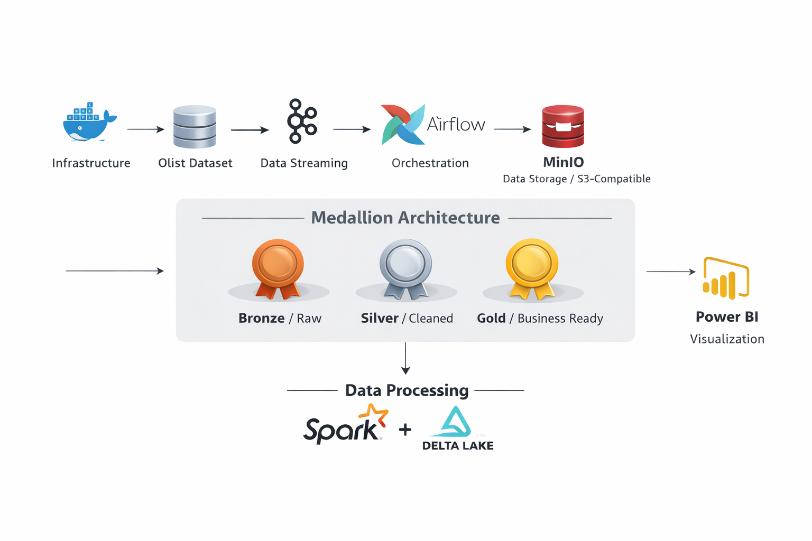
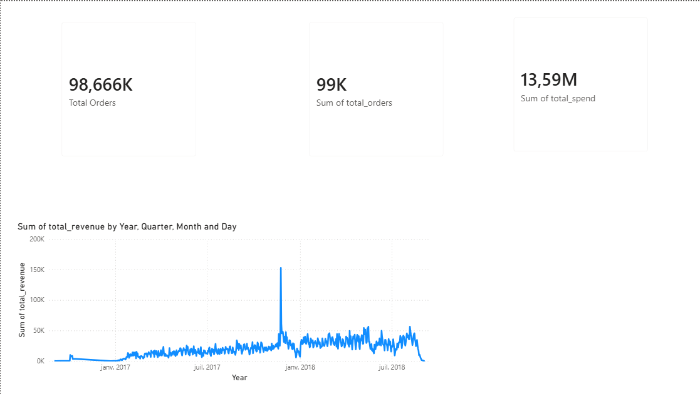
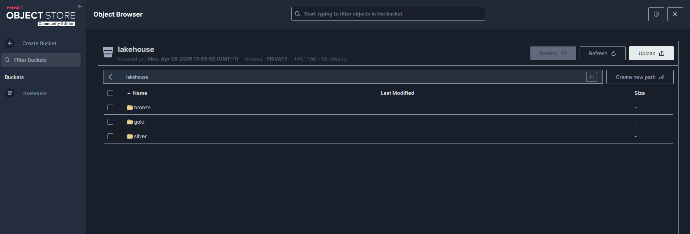

# 🏗️ Lakehouse E-Commerce Analytics — Medallion Architecture

A end-to-end **Data Engineering** project built on the [Olist Brazilian E-Commerce dataset](https://www.kaggle.com/datasets/olistbr/brazilian-ecommerce), implementing a full **Medallion Lakehouse Architecture** (Bronze → Silver → Gold) with real-time event streaming, orchestrated transformations, and business KPI reporting.

---

## 📐 Architecture



| Layer | Description |
|---|---|
| **Infrastructure** | All services containerized with Docker Compose |
| **Data Streaming** | Apache Kafka simulates real-time order events from Olist CSV files |
| **Orchestration** | Apache Airflow manages and sequences all pipeline DAGs |
| **Storage** | MinIO (S3-compatible) stores all layers in the `lakehouse` bucket |
| **Bronze** | Raw data landed as-is from Kafka and CSV sources |
| **Silver** | PySpark cleans, deduplicates, casts types, and applies data quality checks |
| **Gold** | PySpark aggregates business-ready tables for reporting |
| **Data Processing** | Apache Spark + Delta Lake for reliable, versioned transformations |
| **Visualization** | Power BI connects to Gold layer Parquet files for KPI dashboards |

---

## 📊 Power BI Dashboard



Key metrics exposed from the Gold layer:
- **98,666K** Total Orders processed
- **13.59M** Total Revenue (BRL)
- Daily revenue trend from 2017 to 2018
- Top sellers by sales volume and review score
- Customer segmentation by state and spending

---

## 🗂️ MinIO Storage



The `lakehouse` bucket contains 3 folders corresponding to the Medallion layers — **146 MiB, 55 objects** written by the pipeline.

---

## 🛠️ Tech Stack

| Tool | Version | Role |
|---|---|---|
| Apache Kafka | 7.5.0 (Confluent) | Event streaming |
| Apache Airflow | 2.x | Orchestration |
| Apache Spark | 3.5.1 | Distributed processing |
| Delta Lake | 2.4 | Table format (ACID, versioning) |
| MinIO | latest | S3-compatible object storage |
| PostgreSQL | 15 | Airflow metadata database |
| Docker Compose | - | Local infrastructure |
| Power BI Desktop | - | Business reporting |
| Python | 3.11 | DAGs, Spark jobs, Kafka producer |

---

## 📁 Project Structure

```
lakehouse-project/
├── airflow/
│   ├── dags/
│   │   ├── include/
│   │   │   ├── __init__.py
│   │   │   └── bronze_helpers.py
│   │   ├── bronze_dag.py       # Ingest raw data → Bronze layer
│   │   ├── silver_dag.py       # Clean & validate → Silver layer
│   │   └── gold_dag.py         # Aggregate → Gold layer
│   ├── Dockerfile
│   └── requirements.txt
├── spark/
│   ├── silver_job.py           # PySpark transformation job
│   └── gold_job.py             # PySpark aggregation job
├── kafka/
│   └── producer.py             # Simulates order events from CSV
├── data
├── docker-compose.yml
└── README.md
```

---


## 📦 Pipeline Details

### Bronze Layer
- Kafka producer reads `olist_orders_dataset.csv` and publishes events to the `olist-orders` topic
- Airflow DAG consumes messages and lands them raw as **Parquet** in `s3a://lakehouse/bronze/`
- No transformation — data is stored exactly as received

### Silver Layer
- PySpark job reads Bronze Parquet files
- Transformations: null cleaning, date standardization, type casting, deduplication
- Data quality checks: null rate < 5% on key columns, row count > 0, no duplicate `order_id`
- Results written as **Delta Lake** tables to `s3a://lakehouse/silver/`

### Gold Layer
- PySpark aggregation job reads Silver Delta tables
- Produces 3 business-ready tables:

| Table | Columns |
|---|---|
| `daily_revenue` | date, total_revenue, order_count |
| `top_sellers` | seller_id, total_sales, avg_review_score |
| `customer_segments` | customer_state, total_orders, total_spend |

- Written as **Delta Lake** tables to `s3a://lakehouse/gold/`

---

## 📈 Key Results

After running the full pipeline on the Olist dataset:
- **~100K orders** processed end-to-end
- **3 Gold tables** ready for business consumption
- **146 MiB** of data stored across Bronze, Silver, and Gold layers in MinIO
- Full revenue trend analysis available from January 2017 to August 2018

---


## 📌 Future Improvements

- [ ] Migrate MinIO to real AWS S3 for cloud deployment
- [ ] Add dbt for Silver → Gold transformation layer
- [ ] Implement Great Expectations for advanced data quality
- [ ] Add CI/CD pipeline with GitHub Actions
- [ ] Deploy Airflow on Kubernetes with KubernetesExecutor

---

